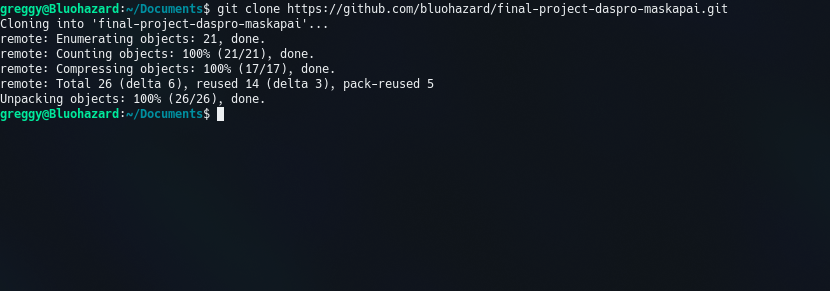
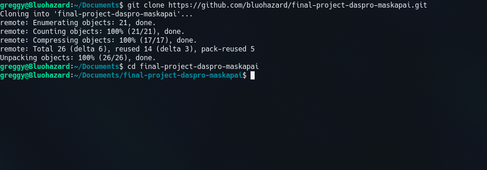
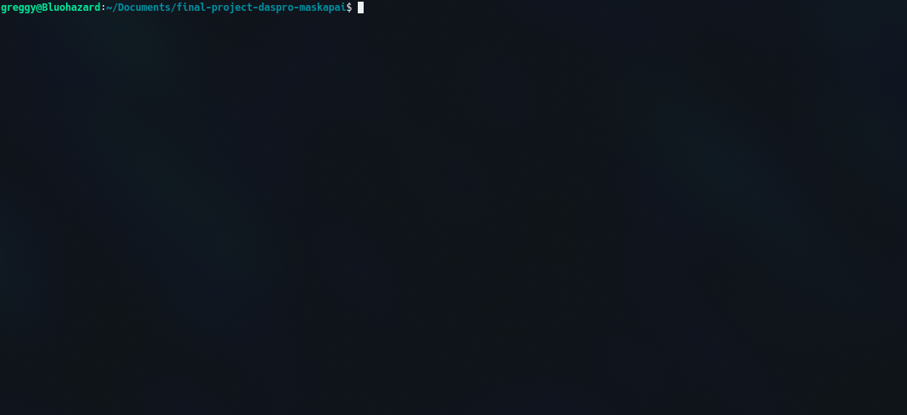
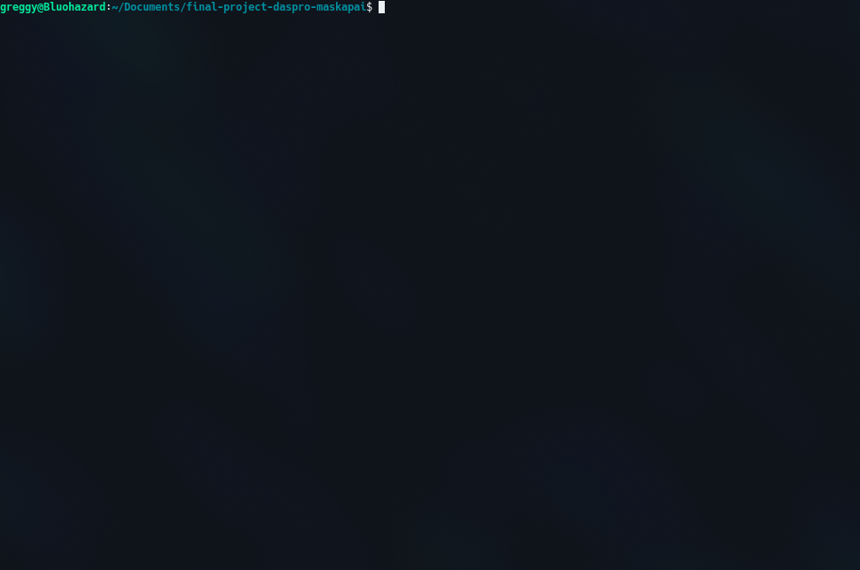

# Maskapai
Simple java application for purchasing airplane tickets

## Installation

1. Clone the repo
```
git clone https://github.com/bluohazard/final-project-daspro-maskapai.git
```
<p align="center">
  
</p>

2. Go to project directory
```
cd final-project-daspro-maskapai
```
<p align="center">
  
</p>

3. Compile this project
```
javac maskapai.java
```
<p align="center">
  
</p>

4. Run this project
```
java maskapai
```

<p align="center">
  
</p>

## Demo

<p align="center">
  
</p>
